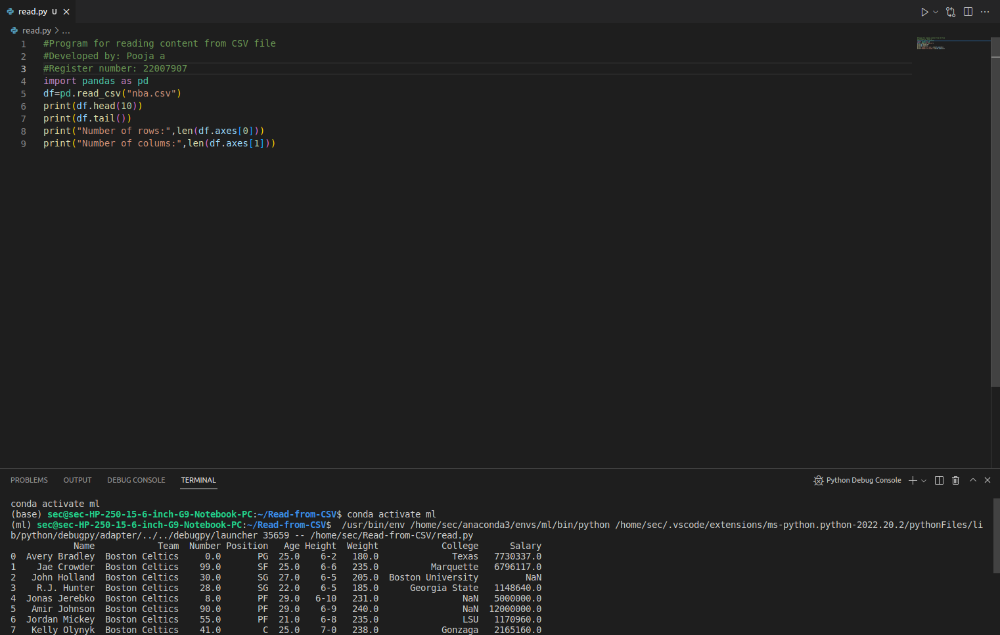

# Read-from-CSV

## AIM:
To write a python program to read the datas from a CSV file.

# ALGORITHM:
# Step 1:
Download a CSV file

# Step 2:
Open a python platform

# Step 3:
Create a folder in python

# Step 4:
Copy the downloaded CSV file to the python folder

# Step 5:
Run the program

## PROGRAM:
```
#Program for reading content from CSV file
#Developed by: pooja a
#Register number: 22007907
import pandas as pd
df=pd.read_csv("nba.csv")
print(df.head(10))
print(df.tail())
print("Number of rows:",len(df.axes[0]))
print("Number of colums:",len(df.axes[1]))
```

## OUTPUT:



## RESULT:
Thus a python program is written to read the contents of a CSV file.

